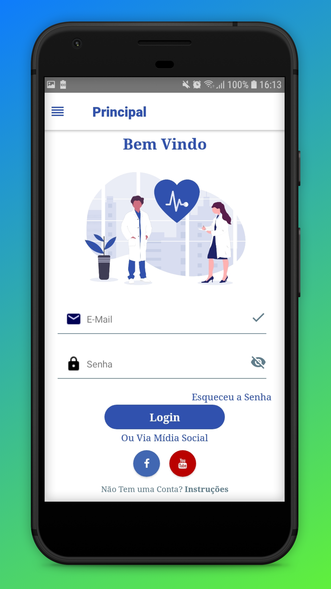
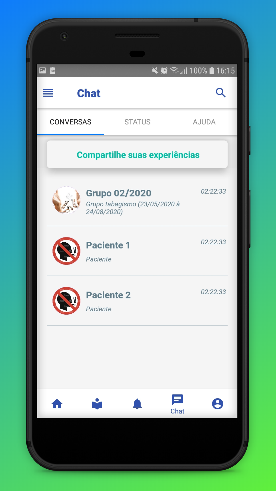

# VRSmoking-Mobile

Requisito Parcial de um Projeto de Iniciação Científica Voltado a Área da Saúde (Ferramenta de Apoio ao Tratamento do Tabagismo da Clínica de Fisioterapia da Universidade do Oeste Paulista).

Experiência com:
- JavaScript;
- React Native;
- Redux;
- Redux-Saga;
- Publicação de App (Play Store);
- Entre outras.

       
