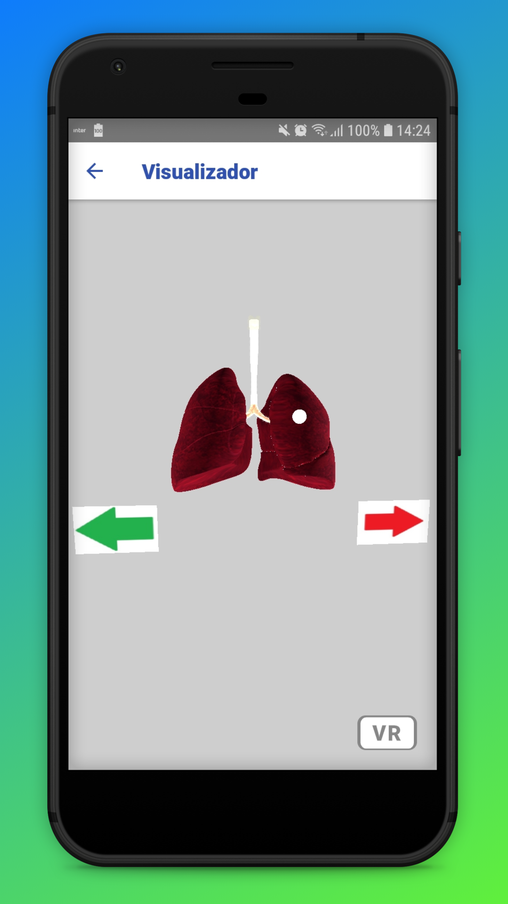

# VRSmoking-Mobile

Ferramenta de Apoio ao Tratamento do Tabagismo.

Experiência com:
- JavaScript;
- React Native;
- Redux;
- Redux-Saga;
- A-Frame;
- Publicação de App (Play Store);
- Entre outras.

- Imagens desatualizadas...

       
